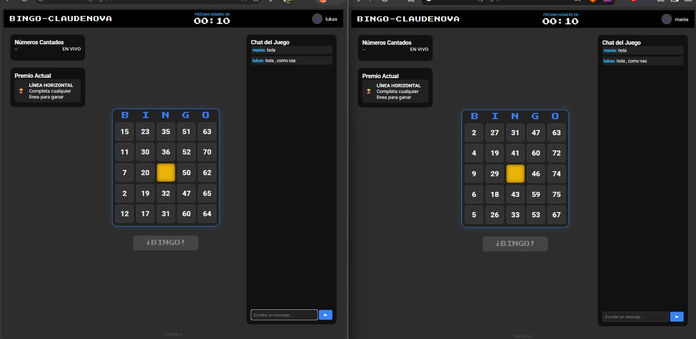
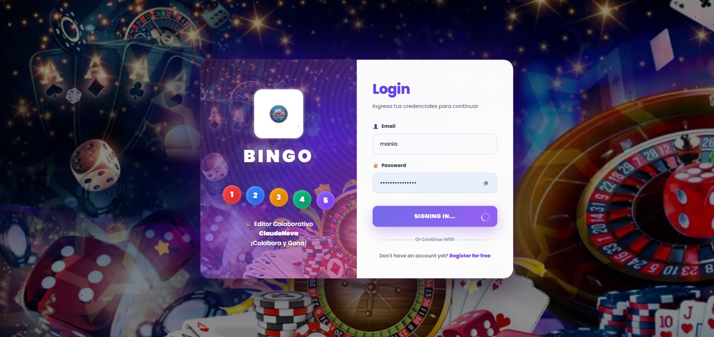
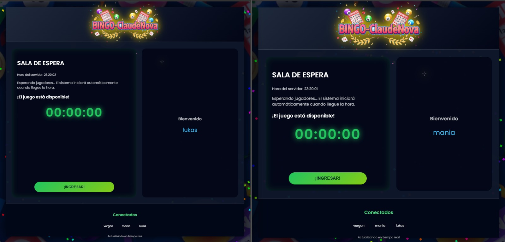
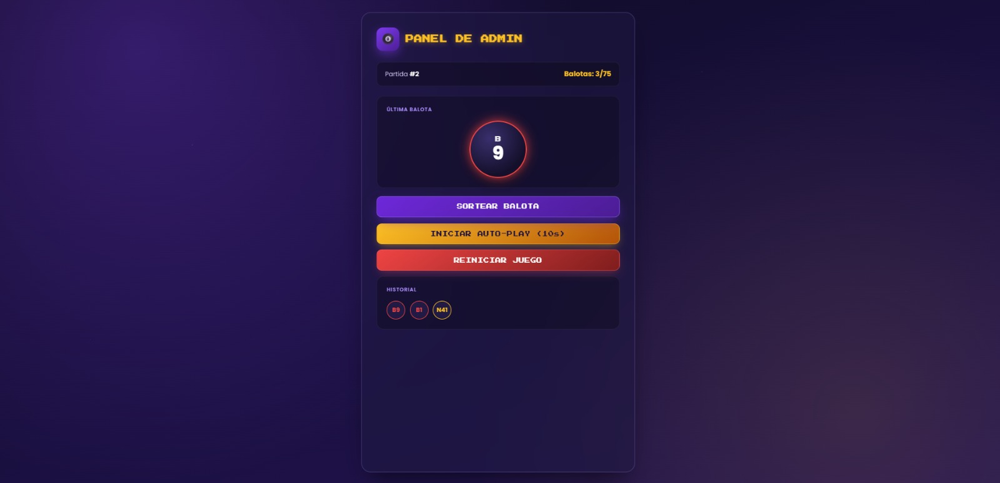

# 🎱 Bingo ClaudeNova

<p align="center">
  
</p>

<h3 align="center">🎮 Plataforma web de Bingo multijugador en tiempo real</h3>

<p align="center">
  Aplicación web desarrollada con Django y Django Channels para gestionar
  partidas de Bingo, jugadores, salas y comunicación en tiempo real mediante WebSockets.
</p>

---

## 📌 Descripción

**Bingo ClaudeNova** es una aplicación web de Bingo multijugador diseñada para permitir que varios jugadores participen en una misma partida mientras reciben las actualizaciones del juego en tiempo real.

El sistema permite gestionar jugadores, salas de espera, cartones de Bingo, sorteo de balotas, validación de BINGO y comunicación entre los participantes.

La aplicación utiliza **Django Channels y WebSockets** para mantener una comunicación en tiempo real entre el servidor y los jugadores conectados.

### ✨ Características principales

- 🔐 Registro e inicio de sesión de usuarios.
- ⏳ Sala de espera para los jugadores.
- 🎱 Cartones de Bingo de 75 bolas.
- 🎲 Sorteo de balotas en tiempo real.
- 💬 Chat entre jugadores.
- 🏆 Validación de BINGO.
- 🔄 Reinicio de partidas.
- 👑 Panel de administración.
- ⚡ Comunicación en tiempo real mediante WebSockets.
- 👥 Soporte para múltiples jugadores.
- 🎯 Validación de líneas horizontales, verticales y diagonales.

---

# 🖥️ Interfaz del proyecto

## 🔐 Inicio de sesión

<p align="center">
  
</p>

La aplicación cuenta con un sistema de autenticación que permite a los usuarios iniciar sesión para acceder a las funcionalidades del juego.

Los usuarios deben ingresar sus credenciales para poder participar en una partida.

---

## ⏳ Sala de espera

<p align="center">
  
</p>

La sala de espera permite a los jugadores permanecer conectados mientras se prepara la partida.

Desde esta sección los jugadores pueden esperar el inicio del juego y visualizar la información correspondiente a la sala.

---

## 🎱 Partida de Bingo

<p align="center">
  
</p>

Durante la partida, cada jugador dispone de un cartón de Bingo generado automáticamente.

El juego utiliza el formato tradicional de **Bingo de 75 bolas**, organizado en cinco columnas:

```text
B → 1 - 15
I → 16 - 30
N → 31 - 45
G → 46 - 60
O → 61 - 75
```

Cada cartón tiene una estructura de:

```text
5 × 5
```

La casilla central corresponde a una casilla gratuita.

Los jugadores pueden marcar las balotas que hayan sido sorteadas y utilizar la opción **BINGO** cuando consideren que han completado un patrón ganador.

---

## 👑 Panel de administración

<p align="center">
  
</p>

El sistema cuenta con un panel administrativo desde el cual se puede controlar el funcionamiento de la partida.

Entre las acciones disponibles se encuentran:

- 🎱 Sortear una nueva balota.
- 🔄 Reiniciar la partida.
- 👀 Controlar el estado del juego.
- 👥 Gestionar el desarrollo de la partida.

Cuando el administrador realiza una acción, los jugadores conectados reciben la actualización mediante WebSockets.

---

# ⚡ Comunicación en tiempo real

Uno de los componentes principales del proyecto es la comunicación en tiempo real.

Para esto se utiliza:

- **Django Channels**
- **WebSockets**
- **Daphne**
- **ASGI**

Los eventos permiten actualizar la información del juego sin que los jugadores tengan que recargar manualmente la página.

### Eventos principales

```text
new_ball
chat_message
bingo_claim
game_over
game_reset
```

### Flujo de comunicación

```text
              ┌─────────────────────┐
              │      JUGADORES      │
              │                     │
              │  🎱 Bingo           │
              │  💬 Chat            │
              │  🏆 BINGO           │
              └──────────┬──────────┘
                         │
                     WebSocket
                         │
                         ▼
              ┌─────────────────────┐
              │   DJANGO CHANNELS   │
              │                     │
              │     Consumers       │
              └──────────┬──────────┘
                         │
                         ▼
              ┌─────────────────────┐
              │       DJANGO        │
              │                     │
              │ Models / Services   │
              │ Views / Logic       │
              └──────────┬──────────┘
                         │
                         ▲
                         │
                     WebSocket
                         │
              ┌──────────┴──────────┐
              │     ADMINISTRADOR   │
              │                     │
              │ 🎱 Sortear balota   │
              │ 🔄 Reiniciar juego  │
              └─────────────────────┘
```

---

# 🏗️ Arquitectura del proyecto

La estructura principal del proyecto es la siguiente:

```text
bingoclaudenova/
│
├── .github/
│   └── workflows/
│
├── editor/
│   ├── migrations/
│   │
│   ├── static/
│   │   ├── css/
│   │   ├── js/
│   │   └── imagenes/
│   │
│   ├── templates/
│   │   └── editor/
│   │       ├── login.html
│   │       ├── register.html
│   │       ├── sala_espera.html
│   │       ├── juego.html
│   │       └── admin_panel.html
│   │
│   ├── admin.py
│   ├── apps.py
│   ├── consumers.py
│   ├── models.py
│   ├── routing.py
│   ├── services.py
│   ├── urls.py
│   └── views.py
│
├── proyecto/
│   ├── asgi.py
│   ├── settings.py
│   ├── urls.py
│   └── wsgi.py
│
├── .deployment
├── .gitignore
├── db.sqlite3
├── manage.py
├── requirements.txt
├── setup_usuarios_prueba.py
├── startup.sh
│
├── ini.jpeg
├── sala.jpeg
├── juego.jpeg
└── admin.jpeg
```

---

# 🧩 Tecnologías utilizadas

| Tecnología | Uso |
|---|---|
| 🐍 **Python** | Lenguaje principal del proyecto |
| 🌐 **Django** | Framework principal para el desarrollo web |
| ⚡ **Django Channels** | Comunicación en tiempo real |
| 🔌 **Daphne** | Servidor ASGI |
| 🗄️ **SQLite** | Base de datos utilizada durante el desarrollo |
| 🎨 **HTML5** | Estructura de las interfaces |
| 🎨 **CSS3** | Diseño y estilos |
| 📜 **JavaScript** | Interactividad y comunicación WebSocket |
| 🔌 **WebSockets** | Comunicación bidireccional en tiempo real |

---

# 🎯 Funcionamiento general

El funcionamiento de la aplicación se puede resumir en las siguientes etapas:

```text
┌─────────────────────────┐
│   1. REGISTRO / LOGIN   │
└────────────┬────────────┘
             │
             ▼
┌─────────────────────────┐
│    2. SALA DE ESPERA    │
└────────────┬────────────┘
             │
             ▼
┌─────────────────────────┐
│     3. PARTIDA BINGO    │
│                         │
│ 🎱 Cartón               │
│ 🎲 Balotas              │
│ 💬 Chat                 │
│ 🏆 BINGO                │
└────────────┬────────────┘
             │
             │ WebSocket
             ▼
┌─────────────────────────┐
│   4. SERVIDOR DJANGO    │
│                         │
│ Django Channels         │
│ Consumers               │
│ Services                │
└────────────┬────────────┘
             ▲
             │
             │ WebSocket
             │
┌────────────┴────────────┐
│   5. ADMINISTRADOR      │
│                         │
│ 🎱 Sortear balota       │
│ 🔄 Reiniciar partida    │
│ 👀 Controlar juego      │
└─────────────────────────┘
```

---

# 🎱 Lógica del Bingo

El proyecto implementa un sistema de **Bingo de 75 bolas**.

Las bolas están distribuidas de la siguiente manera:

| Columna | Rango |
|---|---:|
| **B** | 1 - 15 |
| **I** | 16 - 30 |
| **N** | 31 - 45 |
| **G** | 46 - 60 |
| **O** | 61 - 75 |

Cada cartón tiene una matriz de:

```text
5 × 5
```

La casilla central de la columna **N** corresponde a una casilla gratuita.

### 🏆 Patrones de BINGO

La validación contempla diferentes patrones ganadores:

- ➡️ Líneas horizontales.
- ⬇️ Líneas verticales.
- ↘️ Diagonal principal.
- ↙️ Diagonal secundaria.

Cuando un jugador reclama **BINGO**, el servidor verifica las condiciones correspondientes antes de determinar el resultado.

---

# 👥 Usuarios de prueba

El proyecto incluye un script para crear usuarios y datos de prueba:

```bash
python setup_usuarios_prueba.py
```

Los usuarios de prueba incluidos son:

| Usuario | Contraseña |
|---|---|
| `alice` | `alice123` |
| `bob` | `bob123` |
| `charlie` | `charlie123` |

> ⚠️ Estas credenciales están destinadas únicamente al entorno de prueba local. No deben utilizarse como credenciales reales en producción.

---

# 🚀 Instalación

## 1. Clonar el repositorio

```bash
git clone <URL_DEL_REPOSITORIO>
```

Entrar al proyecto:

```bash
cd bingoclaudenova
```

---

## 2. Crear el entorno virtual

En Windows:

```powershell
py -3.14 -m venv venv
```

Activar el entorno virtual:

```powershell
.\venv\Scripts\Activate.ps1
```

Si PowerShell bloquea la ejecución del script, se puede utilizar:

```powershell
Set-ExecutionPolicy -ExecutionPolicy RemoteSigned -Scope CurrentUser
```

Después volver a activar:

```powershell
.\venv\Scripts\Activate.ps1
```

---

## 3. Instalar las dependencias

Con el entorno virtual activado:

```powershell
pip install -r requirements.txt
```

---

## 4. Ejecutar las migraciones

```powershell
python manage.py migrate
```

---

## 5. Crear usuarios de prueba

```powershell
python setup_usuarios_prueba.py
```

---

## 6. Ejecutar el servidor

```powershell
python manage.py runserver
```

La aplicación estará disponible en:

```text
http://127.0.0.1:8000/
```

---

# 👑 Panel de administración

Para crear un usuario administrador de Django:

```powershell
python manage.py createsuperuser
```

Después de crear el usuario, se puede acceder al panel administrativo mediante:

```text
http://127.0.0.1:8000/admin/
```

El panel administrativo del juego se encuentra disponible en:

```text
http://127.0.0.1:8000/panel/
```

El usuario debe contar con los permisos correspondientes para acceder al panel.

---

# 🔌 Rutas WebSocket

El proyecto utiliza diferentes conexiones WebSocket para mantener actualizada la información entre el servidor y los clientes.

Actualmente se utilizan las siguientes rutas:

```text
/ws/sala/
/ws/juego/
```

### Sala

```text
/ws/sala/
```

Permite gestionar la comunicación relacionada con la sala de espera.

### Juego

```text
/ws/juego/
```

Permite gestionar eventos relacionados con la partida de Bingo.

---

# 📁 Componentes principales

## `models.py`

Contiene los modelos utilizados para representar la información principal de la aplicación.

Entre ellos se encuentran:

- `Sala`
- `Partida`
- `Carton`

---

## `views.py`

Gestiona las diferentes vistas y operaciones HTTP de la aplicación.

Entre sus funciones se encuentran:

- Registro de usuarios.
- Inicio de sesión.
- Sala de espera.
- Partida.
- Panel administrativo.
- Sorteo de balotas.
- Reinicio de partidas.

---

## `consumers.py`

Gestiona las conexiones **WebSocket** mediante Django Channels.

Se encarga de procesar eventos enviados entre los jugadores y el servidor.

Algunos de los eventos utilizados son:

```text
new_ball
chat_message
bingo_claim
game_over
game_reset
```

---

## `services.py`

Contiene la lógica de negocio relacionada con el funcionamiento del Bingo.

Entre sus responsabilidades se encuentran:

- Generación de cartones.
- Sorteo de balotas.
- Validación de BINGO.
- Gestión de partidas.
- Lógica relacionada con el juego.

---

## `routing.py`

Define las rutas utilizadas por las conexiones WebSocket.

Ejemplo:

```text
/ws/sala/
/ws/juego/
```

---

# 🛠️ Comandos útiles

### Comprobar la configuración de Django

```powershell
python manage.py check
```

### Crear migraciones

```powershell
python manage.py makemigrations
```

### Ejecutar migraciones

```powershell
python manage.py migrate
```

### Crear superusuario

```powershell
python manage.py createsuperuser
```

### Recopilar archivos estáticos

```powershell
python manage.py collectstatic --noinput
```

### Ejecutar servidor de desarrollo

```powershell
python manage.py runserver
```

### Detener servidor

```text
CTRL + C
```

---

# 📸 Capturas del proyecto

Las imágenes utilizadas en este README se encuentran directamente en la raíz del repositorio:

```text
bingoclaudenova/
│
├── ini.jpeg
├── sala.jpeg
├── juego.jpeg
└── admin.jpeg
```

| Imagen | Descripción |
|---|---|
| `ini.jpeg` | Pantalla de inicio de sesión |
| `sala.jpeg` | Sala de espera |
| `juego.jpeg` | Partida de Bingo |
| `admin.jpeg` | Panel de administración |

---

# 🔄 Flujo de una partida

El funcionamiento general de una partida es:

```text
        👤 Jugador
             │
             ▼
       🔐 Iniciar sesión
             │
             ▼
       ⏳ Sala de espera
             │
             ▼
       🎱 Inicia partida
             │
             ▼
     🎲 Se sortea una bola
             │
             ▼
    ⚡ WebSocket actualiza
        a los jugadores
             │
             ▼
      👤 Jugadores marcan
        sus cartones
             │
             ▼
       🏆 Jugador reclama
            BINGO
             │
             ▼
      🔎 Servidor valida
             │
        ┌────┴────┐
        │         │
        ▼         ▼
      ❌ No      ✅ Sí
     válido     válido
        │         │
        │         ▼
        │      🏆 GANADOR
        │         │
        └────┬────┘
             ▼
       🔄 Reiniciar
        nueva partida
```

---

# 🌐 Despliegue

El proyecto incluye archivos destinados a facilitar el despliegue de la aplicación:

```text
.deployment
startup.sh
```

El archivo `startup.sh` permite definir las instrucciones necesarias para iniciar la aplicación en un entorno de despliegue compatible.

Para un entorno de producción se recomienda utilizar un servidor **ASGI** compatible con Django Channels, como **Daphne**.

---

# 🔒 Consideraciones de seguridad

Para utilizar el proyecto en producción se recomienda:

- 🔑 Utilizar una `SECRET_KEY` segura.
- 🚫 No publicar credenciales reales.
- 🔐 Configurar correctamente `DEBUG=False`.
- 🌐 Configurar `ALLOWED_HOSTS`.
- 🔒 Utilizar HTTPS.
- 🔑 Utilizar variables de entorno para información sensible.
- 🗄️ Utilizar una base de datos apropiada para producción.
- 🛡️ Configurar correctamente los permisos de usuarios.

Las credenciales incluidas en este README son únicamente para pruebas locales.

---

# 📚 Objetivo del proyecto

**Bingo ClaudeNova** fue desarrollado como un proyecto académico y práctico con el objetivo de aplicar conceptos relacionados con:

- Desarrollo web.
- Framework Django.
- Programación en Python.
- Arquitectura cliente-servidor.
- Comunicación mediante WebSockets.
- Desarrollo de aplicaciones en tiempo real.
- Manejo de bases de datos.
- Autenticación de usuarios.
- Diseño de interfaces web.
- Desarrollo de aplicaciones multijugador.

---

# 🚀 Posibles mejoras futuras

Entre las funcionalidades que pueden incorporarse posteriormente se encuentran:

- 👥 Sistema avanzado de salas.
- 🏆 Historial de ganadores.
- 📊 Estadísticas de jugadores.
- 🏅 Sistema de ranking.
- 🎨 Personalización de cartones.
- 🔊 Efectos de sonido.
- 📱 Mejor adaptación a dispositivos móviles.
- 🌐 Base de datos para producción.
- 🔐 Sistema de recuperación de contraseña.
- 👤 Perfil de usuario.
- 📈 Panel de estadísticas administrativas.

---

# 👨‍💻 Autores

<p align="center">
  <strong>Andres Contreras</strong>
  <br>
  <strong>Wilmer Flores</strong>
</p>

---

# 📄 Licencia

Este proyecto fue desarrollado con fines **académicos y educativos**.

Todos los componentes desarrollados forman parte del proyecto **Bingo ClaudeNova**.

---

<p align="center">
  🎱 <strong>Bingo ClaudeNova</strong> 🎱
  <br>
  Plataforma web de Bingo multijugador en tiempo real
</p>
